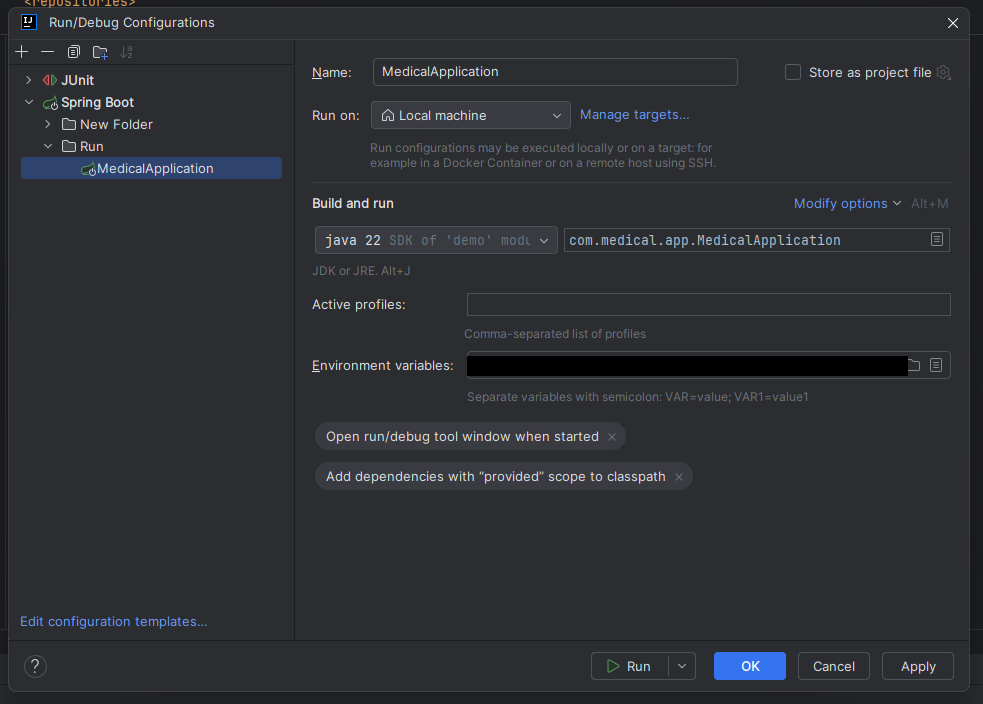

# Medical Appointment Management Application

## Overview
This is a medical appointment management application designed to facilitate communication between doctors and patients. The project was developed for educational purposes to fully test the capabilities offered by Angular on the client side and Spring Boot on the server side. Both the frontend and backend applications communicate via REST APIs.
### Main Frontend Technologies:
- TypeScript
- Angular 17
- PrimeNG
- Luxon
- Karma with Jasmine

### Main Backend Technologies:
- Java 21
- Spring Boot
- Maven
- JUnit
- Mockito
- Lombok
- Flyway
## Main Features
- Patients can book appointments with doctors on the platform.
- Doctors can view, edit, and export appointments.
- Administrators can add, edit, and delete users.
- Front desk users can help doctors by managing appointments.
- Users can have multiple roles assigned (PATIENT, DOCTOR, ADMIN, FRONT_DESK).

## Other Features
- User authentication.
- Patient registration.
- Password reset via OTP sent to email.

## Security
- CSRF protection is enabled.
- JWT tokens are **httpOnly**, sent through headers, and stored as cookies (JavaScript cannot access the token).
- Users receive a token valid for 15 minutes upon login.
- Tokens are refreshed automatically to keep the session active.
- Users must re-authenticate after 12 hours.
- After 20 failed login attempts, the user is blocked for 5 minutes.

## Development
- Flyway is used for database migrations.
- The project structure includes:
  - **backend**: Contains the Java project with Spring Boot.
  - **frontend**: Contains the Angular project.

## Deployment
The deployment process is integrated. When a tag version is generated in GitHub or the workflow is manually triggered, the application is deployed to DockerHub. The images are then downloaded and installed on the SSH server.

## Database
The application uses a MySQL database.

## Getting Started

### Prerequisites
- Node.js 20 or later
- Angular CLI 17
- Maven 3.6
- Java 21

### Installation
1. Clone the repository.
2. Navigate to the `frontend` directory and run:
    ```bash
    npm install
    ```
3. Navigate to the `backend` directory and build the Spring Boot project:
    ```bash
    mvn clean install
    ```

### Running the Application
#### Frontend
Navigate to the `frontend` directory and run:
```bash
npm start
```

#### Backend
Open IntelliJ IDEA and import the `backend` directory as a Maven project. 

You can create in IntelliJ IDEA your own configuration to run the application.


Environment variables to be set:
```bash
DB_NAME=medical_app;
DB_PASSWORD=YourStrongPassword;
DB_URL=jdbc:mysql://localhost:3306/medical_app;
DB_USERNAME=root;
DEBUG_SQL=TRACE;
DISPLAY_VALIDATION_ERRORS=true;
EMAIL_PASSWORD=YourStrongPassword;
EMAIL_USERNAME=your-email-address@yourdomain.com;
JWT_SECRET=YourSecretKey;
SMTP_HOST=smtp.yourdomain.com;
SMTP_PORT=465;
```

See the image below for the configuration of environment variables in IntelliJ IDEA:



## Usage
1. Open the application in your browser at `http://localhost:4201`.
2. Log in with the appropriate role credentials to access different functionalities.

## License
This work is licensed under Creative Commons Attribution-NonCommercial-NoDerivatives 4.0 International. To view a copy of this license, visit https://creativecommons.org/licenses/by-nc-nd/4.0/
